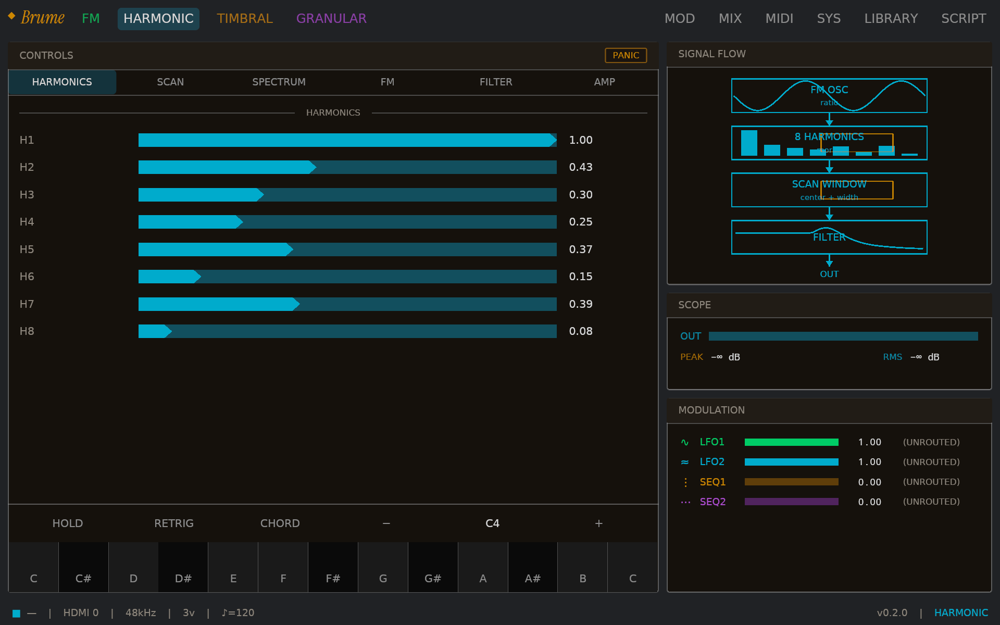

# Brume

A four-part multi-timbral synthesizer that runs on a Raspberry Pi
Compute Module 5. Brume has four sound engines and six voices per
part, a shared filter section feeding an effects chain, a sandboxed
Lua scripting layer, and a 10.1-inch touchscreen UI. A single USB
cable presents the device to a host computer as a class-compliant
audio and MIDI interface.

## What's in the box

- **Engines:** FM, Harmonic, Timbral, Granular
- **Voices:** 6 per part, 24 total
- **Filter:** One state-variable filter per voice
- **Effects:** Saturator, chorus, delay, dattorro plate reverb
- **Modulation:** 2 LFOs and 2 step sequencers per part, 24 named
  transition shapes
- **Scripting:** Sandboxed Lua 5.5; control scripts and FX scripts
- **MIDI:** 16 channels, over USB or a hardware MIDI input
- **Audio:** Stereo over USB; per-part stems also available
- **Display:** iced + wgpu touchscreen, 10.1 inch, 1920×1200

## Hardware

Brume's reference platform is the Raspberry Pi Compute Module 5 on
a carrier IO board, because Brume's audio and MIDI bridge to a host
computer requires USB device-mode and the CM5 IO board exposes that
mode through a USB OTG jumper. Whether the device-mode port on the
carrier is Type-C or Type-A is incidental; what matters is that one
of the carrier's USB ports is wired to the CM5's peripheral
controller. The same combination pairs the
CM5 with a 10.1-inch DSI touchscreen and an audio HAT; the reference
unit's specific parts are documented in [`HARDWARE.md`](HARDWARE.md).
The software is written against the stock Pi kernel and ALSA; notes
from anyone who has gotten Brume running on different IO boards or
audio HATs are welcome in the same file.

## Status

Brume is pre-1.0, hobby-grade, single-maintainer; the tracked
surface is in [`CHANGELOG.md`](CHANGELOG.md).

## Documentation

- [`INSTALL.md`](INSTALL.md): first-time CM5 bring-up.
- [`DEPLOY.md`](DEPLOY.md): iteration loop on a CM5.
- [`HARDWARE.md`](HARDWARE.md): IO board, screen, and audio HAT notes.
- [`CONTRIBUTING.md`](CONTRIBUTING.md): house style, PR flow, and scope.
- [`AGENTS.md`](AGENTS.md): entry point for AI coding agents.
- [`CHANGELOG.md`](CHANGELOG.md): every user-observable change.

## License

Copyright (C) 2026 Brandon Huey <hello@aftertone.co>

Brume is licensed under the GNU General Public License version 3.0
only (GPL-3.0-only). The full license text is in
[`LICENSE`](LICENSE). Contributions land under the same license
without a CLA or copyright reassignment; see
[`CONTRIBUTING.md`](CONTRIBUTING.md) for details.

The Brume wordmark and splash use Instrument Serif by Rodrigo
Fuenzalida and the Instrument Serif Project Authors, distributed
under the SIL Open Font License 1.1; the font and its license live
under [`crates/ui-native/assets/`](crates/ui-native/assets/).
